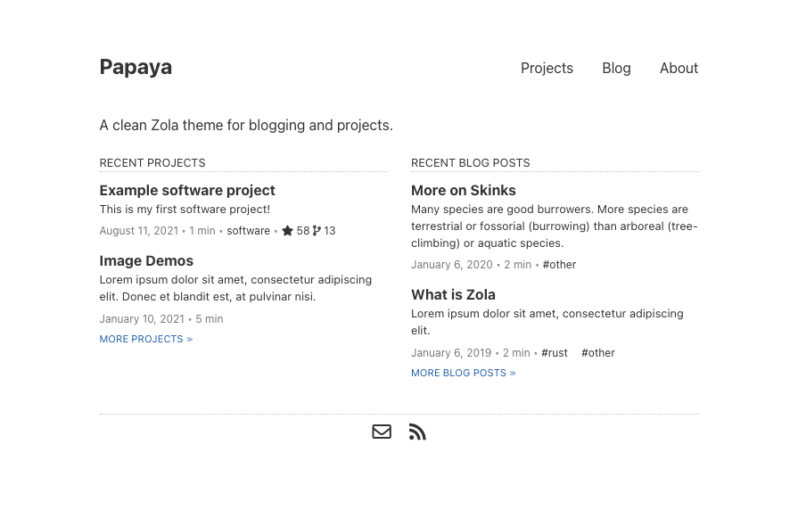
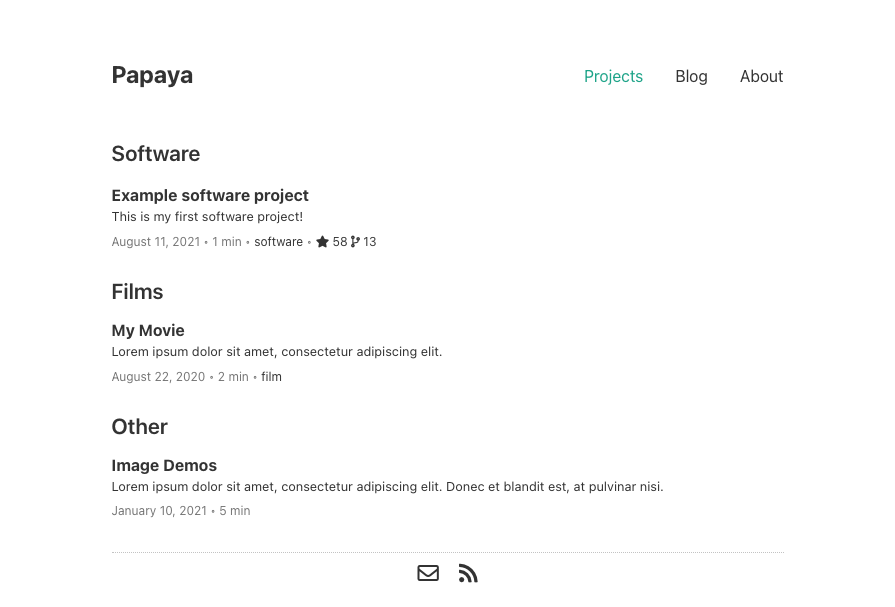
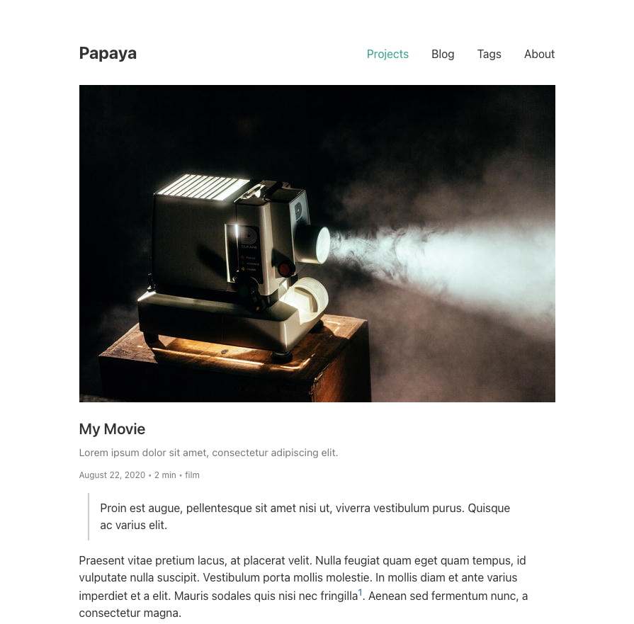
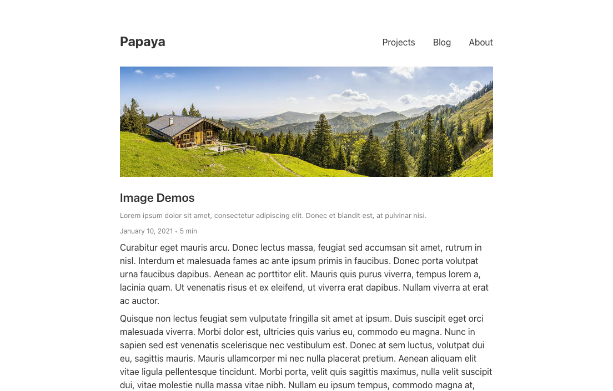
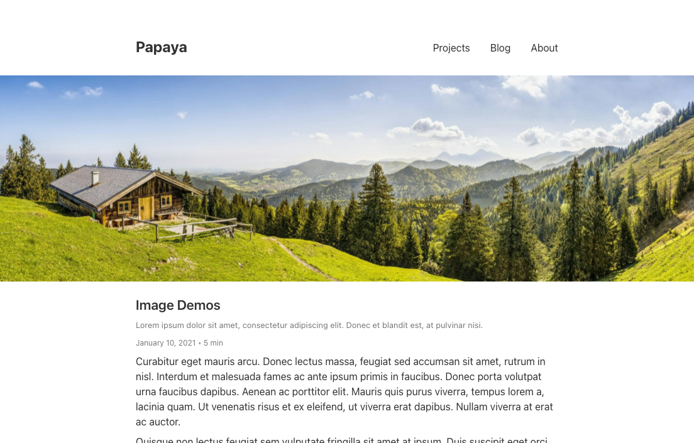
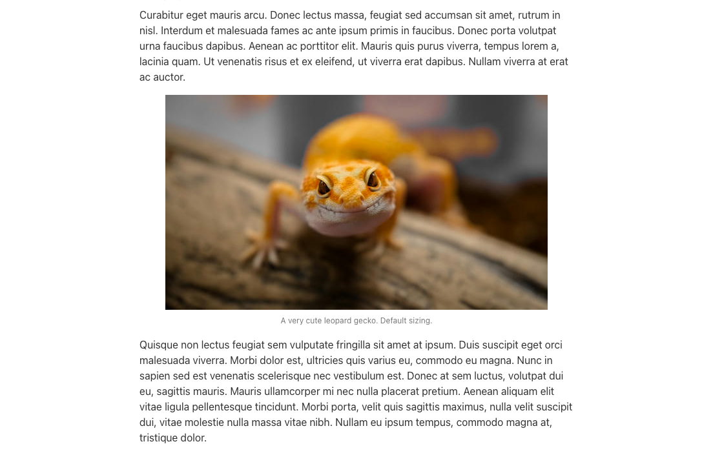
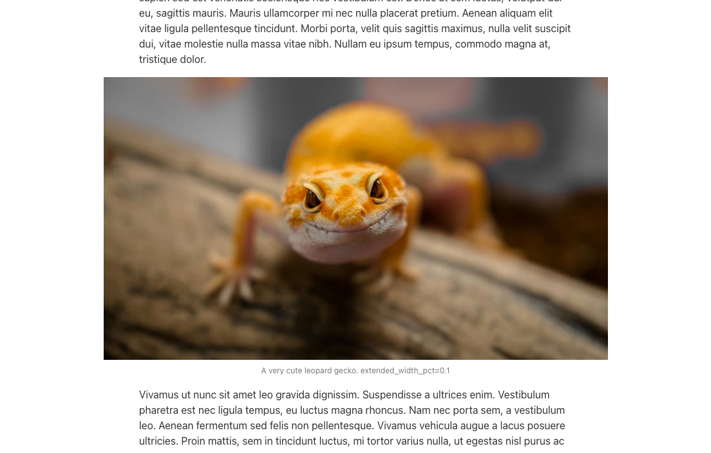
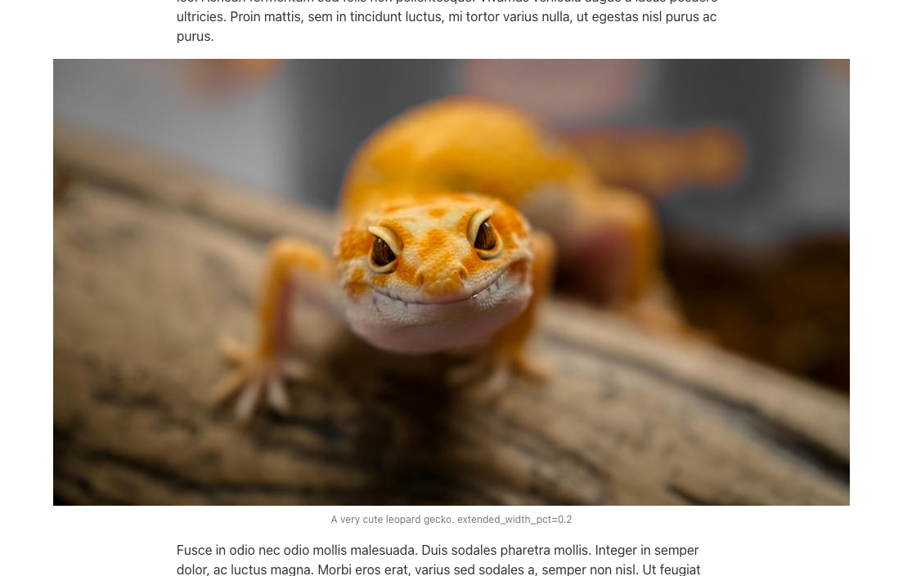
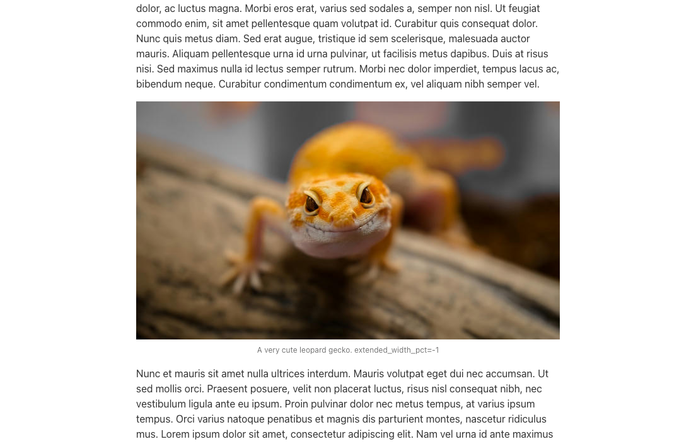

# Papaya

A clean [Zola](https://getzola.org) theme for blogging and projects, forked from [Anpu](https://github.com/zbrox/anpu-zola-theme).

**Demo site**: [https://justintennant.me/papaya/](https://justintennant.me/papaya/)







## Features

- Blog posts
- Project pages
- Categories and tags
- Multilanguage support
- Customizable sections
- Featured images for posts/pages
- Smart image embedding shortcode (`{{ img() }}`)
- GitHub repository star/fork counts
- [Open Graph Protocol](https://ogp.me/) tags
- Social/contact links 
- 100% Google Lighthouse score

## Installation

1. Clone this repository to your `themes` folder:
    
    ```bash
    git clone https://github.com/justint/papaya.git themes/papaya
    ```

2. Set your theme setting in `config.toml` to `papaya`:

    ```toml
    theme = "papaya"
    ```

3. This theme requires both the `tags` and `categories` taxonomies.

    ```toml
    taxonomies = [
        { name = "categories" },
        { name = "tags" },
    ]
    ```

4. In your `content` directory, add new `blog` and `projects` directories. Copy the `_index.md` file from Papaya's `content/blog` into your `content/blog`, and the `_index.md` and `categories.json` files from Papaya's `content/projects` into your `content/projects`.
 
   Your `content` directory structure should look like this:
   ```
   content
   ├── blog
   │  └── _index.md
   └── projects
      └── _index.md
      └── categories.json
   ```
 
5. _(optional)_ To enable GitHub repository stars/fork counts (disabled by default to avoid hitting API rate limits), set the `$ZOLA_ENV` environment variable to `prod` prior to your `zola serve`/`zola build` execution.
   
   For csh/tsch:
   ```shell
   setenv ZOLA_ENV prod
   ```
   
   For bash/ksh/zsh:
   ```shell
   export ZOLA_ENV=prod
   ```

## Customization

Here are the customizable features of Papaya: 

- [Project categories](#project-categories)
- [Multilanguage support](#mutilanguage-support)
- [Custom section and navigation menu links](#custom-section-and-navigation-menu-links)
- [Post/project date formats](#postproject-date-formats)
- [Post/project featured images](#postproject-featured-images)
- [Open Graph Protocol locale/profile information](#open-graph-protocol-localeprofile-information)
- [Social/contact links](#socialcontact-links)

### Project categories

In your `content/projects/categories.json`, you can specify the categories of projects. The formatting of the file is:

```json
{
   "title": "keyword"
}
```

- `"title"`: the title text displayed for each category grouping on your projects page.
- `"keyword"`: the taxonomy term you'll use in your project pages.

A project can have multiple categories, and will be displayed once in each category configured.

Projects without categories will be displayed in the "Other" category listing of your project page. If you don't want the "Other" category displayed, you can copy the `templates/projects.html` to your own `templates` directory and delete/comment out the "Other" category code.

Example `categories.json`:

```json
{
  "Software": "software",
  "Films": "film"
}
```

Example project page front matter:

```toml
title = "Example software project"
date = 2021-08-11

[taxonomies]
categories = ["software"]
```

The example project page above would be grouped into & displayed within the "Software" category of your projects page.

### Mutilanguage support

Currently Zola has a basic i18n support, you can see this at [zola doc](https://www.getzola.org/documentation/content/multilingual/).

Doing the follows to write a multilanguage site (English and Chinese in this example):

1. Add `default_language` configuration, `[languages.zh]` and `[languages.en] section in your `config.toml`:

    ```toml
    default_language = "en"

    [languages]

    [languages.en]

    [languages.zh]
    title = "中文标题"
    description = "中文描述"
    ```

    Under `[languages.zh]` section you can override default configurations like title, description.

2. Add translations of all keywords in `[langauges.zh.translations]` and `languages.en.translations]` section:

    ```toml
    [languages]

    [languages.en]

    [languages.en.translations]
    projects = "Projects"
    blog = "Blog"
    about = "About"
    recent_projects = "Recent Projects"
    more_projects = "More Projects"
    recent_blog_posts = "Recent Blog Posts"
    more_blog_posts = "More blog posts"
    ...

    [languages.zh]

    [languages.zh.translations]
    projects = "项目"
    blog = "博文"
    about = "关于"
    recent_projects = "近期项目"
    more_projects = "更多项目"
    recent_blog_posts = "近期博文"
    more_blog_posts = "更多博文"
    ...
    ```

3. Add `_index.zh.md` to every section, e.g., add `content/blog/_index.zh.md` and `content/projects/_index.zh.md`. `content/about` is not a zola section, it is just a page, doesn't contain any other page, so it didn't contain a `_index.md`, instead it contains a `index.md` (see [zola doc](https://www.getzola.org/documentation/content/page/)), so if you want to translate this page, you should add a `index.zh.md`, but this is not necessary.
4. Add file `content/categories.zh.json`, for example:

    ```json
    {
        "软件": "software",
        "电影": "film"
    }
    ```

Now you will have a blog with both English and Chinese! Since `default_language` in `config.toml` is set to "en", by visiting `base_url` you will see the English version of this blog. You can visit the Chinese version by visiting `base_url/zh`.

A page (post or project) can be avaiable in both language or only in one language, and it's not necessary that a page is avaiable in the default language.

### Custom section and navigation menu links

A section is created whenever a directory (or subdirectory) in the content section contains an `_index.md` file, see [zola docs](https://www.getzola.org/documentation/content/section/).

Papaya has three sections by default: `projects`, `blog` and `about` (actually `about` is not a zola section, because it is a single page). You can add additional sections or change section names. For example, you can add a section called **Diary**, in order to add this section, you need to:

1. Create a directory called `diary` in `content/`
2. Create `_index.md` inside `content/diary`, for example:

    ```markdown
    +++
    title = "Diary"
    render = true
    # diary will use blog.html for its template
    template = "blog.html"
    +++
    ```

3. In your `config.toml` under the `[extra]` section adds the following item to key `sections`:

    ```toml
    [extra]
    sections = [
        ...
        { name = "diary", show_recent = true, recent_items = 3, recent_trans_key = "recent_diary", more_trans_key = "more_diary" }
    ]
    ```

4. In `config.toml` under the `[languages.<code>.translations]` section adds the following item:

    ```toml
    [languages]

    [languages.en]

    [languages.en.translations]
    diary = "Diary"
    recent_diary = "Recent Diaries"
    more_diary = "More Diaries"

    [languages.zh]

    [languages.zh.translations]
    diary = "日记"
    recent_diary = "近期日记"
    more_diary = "更多日记"
    ```

After that you should see `Diary` appeared in the navigation menu.

If you want to add a custom link in the navigation menu, you can add a special section in the `sections` configuration, for example:

```toml
[extra]
sections = [
    ...
    { name = "tag", url = "$LANG_BASE_URL/tags" }
]
```

As the same with the diary example, the `name` attribute of section specifies the corresponding translation key:

```toml
[languages]

[languages.en]

[languages.en.translations]
tag = "Tag"

[languages.zh]

[langauges.zh.translations]
tag = "标签"
```

If you include `$BASE_URL` in the URL of a link it will be replaced with the base URL of your site, and `$LANG_BASE_URL` will be replaced with the language-specific base URL of your site.

### Post/project date formats

You can have different date formats in different language. You need to set the `date_format` value in every langauge's translation section.

Example:

```toml
[languages]

[languages.en]

[languages.en.translations]
date_format = "%e %B %Y"

[languages.zh]

[languages.zh.translations]
date_format = "%Y 年 %m 月 %d 日"
```

The formatting uses the standard `date` filter in Tera. The date format options you can use are listed in the [chrono crate documentation](https://tera.netlify.app/docs/#date).

### Post/project featured images

Posts and projects can have featured images which display at the top of their page before the page contents.

```toml
[extra]
featured_image = "image.jpg"
featured_image_alt = "A lodge overlooks a forested mountain range."
```



Featured images can also be extended to the full width of the viewport:

```toml
[extra]
featured_image = "image.jpg"
featured_image_alt = "A lodge overlooks a forested mountain range."
featured_image_extended = true
```



### Open Graph Protocol locale/profile information

In your `config.toml` you can add a `[extra.ogp]` section to specify your Open Graph Protocol locale and profile information.

Open Graph Protocol provides you control over how your website's content should be displayed on social media sites. 

For the more information on Open Graph Protocol and valid property values, visit the official [website](https://ogp.me/). 

Example:

```toml
[extra.ogp]
locale = "en_US"
first_name = "Papaya"
last_name = "Tiliqua"
gender = "female"
username = "tiliquasp"
```

### Social/contact links

In your `config.toml` you can add a `[extra.social]` section to specify your social network/contact accounts. Changing these will update what links appear on your website's footer.

Example:

```toml
[extra.social]
email = "papaya@tiliqua.sp"
github = "papaya"
linkedin = "papayatiliqua"
twitter = ""
zhihu = ""
weibo = ""
bilibili = ""
```

If you want to add some custom social websites, you can add them to `other`:

Example:

```toml
[extra.social]
other = [
    { name = "BTC", font_awesome = "fa-brands fa-btc", url = "https://www.bitcoin.com/" }
]
```

`font_awesome` attribute specified the font awesome classes, you can find them in [Font Awesome](https://fontawesome.com/). Be carefull, different version of font awesome may include different sets of icons, you can change the version of font awesome by changing CDN in `[extra.cdn]` section:

```toml
[extra]

[extra.cdn]
font_awesome = "https://cdnjs.cloudflare.com/ajax/libs/font-awesome/6.0.0-beta2/css/all.min.css"
```

## Image embedding shortcode

Included with Papaya is a shortcode for embedding images into your posts:

```
img(path, alt, caption, class, extended_width_pct)
```

You can use `./<image-path>` to specify the relative path of image which is relative to current markdown file.

### Arguments

- `path`: The path to the image relative to the `content` directory in the [directory structure](https://www.getzola.org/documentation/getting-started/directory-structure/).
- `alt`: _(optional)_ The alternate text for the image.
- `caption`: _(optional)_ A caption for the image. Text/HTML/Tera templates supported.
- `class`: _(optional)_ Any CSS classes to assign to the image. Multiple classes should be separated with a space (`" "`).
- `extended_width_pct`: _(optional)_ The percentage by which the image's width should be expanded past it's default figure width, up to maximum configured pixel width. 

   Range is `0.0-1.0`, or `-1` for document width. 

   Max pixel width can be defined in your `config.toml`  with the `extra.images.max_width` property (2500px default).

   See [Extended width images](#extended-width-images) section for more details and examples.

The benefits of using this shortcode over regular Markdown/HTML image embedding are:

- Images are automatically resized for best performance, using Zola's [image processing functions](https://www.getzola.org/documentation/content/image-processing/)
- Images & captions are ✨pre-styled✨ for you
- Images can have their width extended past the document's width (see: [Extended width images](#extended-width-images))
- Less HTML/CSS boilerplate to write


### Extended width images

Images embedded into pages using the `img` shortcode can be configured to extend past their document width. This is especially nice for displaying wide/landscape images at higher resolutions.

By default, images embedded with the `img` shortcode will be inserted as a `figure` with default margins:

```js
{{ img(path="image.jpg", 
       alt="A very cute leopard gecko.", 
       caption="A very cute leopard gecko. Default sizing.") }}
```



With the `extended_width_pct` argument, we can specify a percentage of how much the image should expand outside its default figure width, up to your maximum configured image width (`config.extra.images.max_width`, 2500px default).

Here's an example with `extended_width_pct=0.1`:

```js
{{ img(path="image.jpg", 
       alt="A very cute leopard gecko.", 
       caption="A very cute leopard gecko. extended_width_pct=0.1",
       extended_width_pct=0.1) }}
```



The image is now displayed with a 10% larger width, while maintaining its original aspect ratio.

Here's an even wider example:

```js
{{ img(path="image.jpg", 
       alt="A very cute leopard gecko.", 
       caption="A very cute leopard gecko. extended_width_pct=0.2",
       extended_width_pct=0.2) }}
```



The images will resize in resolution up to your maximum configured image width, and will display on the webpage up to the maximum width of the viewport.

You can also force the image width to match the document's width by setting `extended_width_pct` to `-1`:

```js
{{ img(path="image.jpg", 
       alt="A very cute leopard gecko.", 
       caption="A very cute leopard gecko. extended_width_pct=-1",
       extended_width_pct=-1) }}
```



## Why "Papaya"?

🦎
